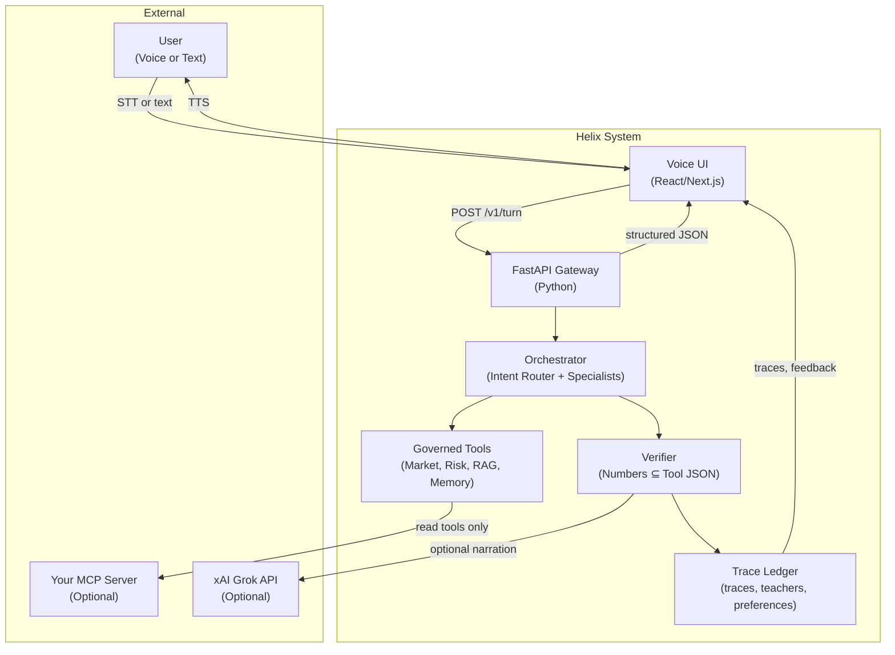
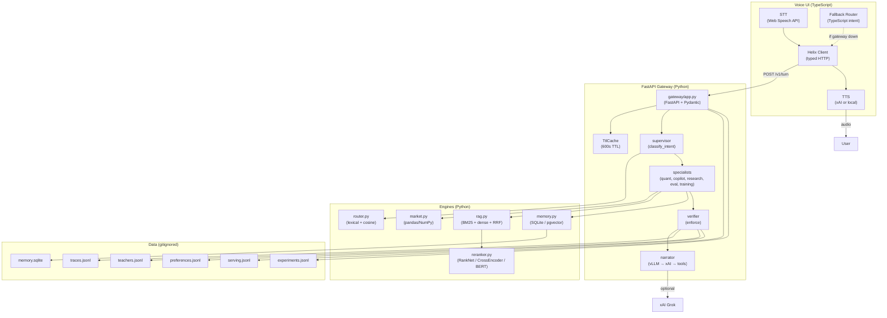
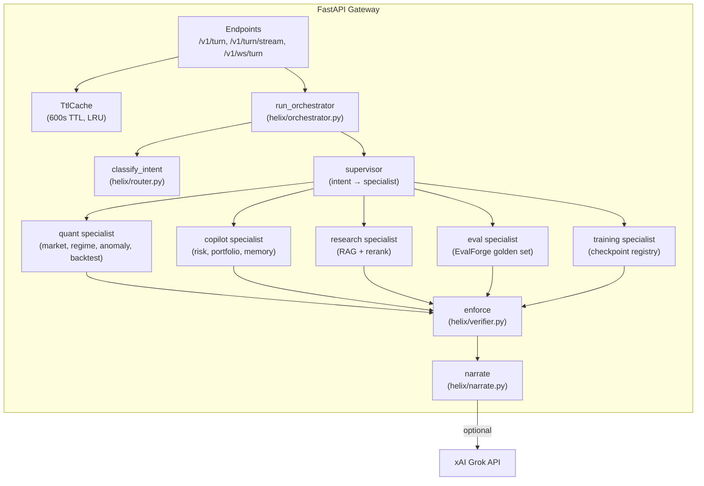
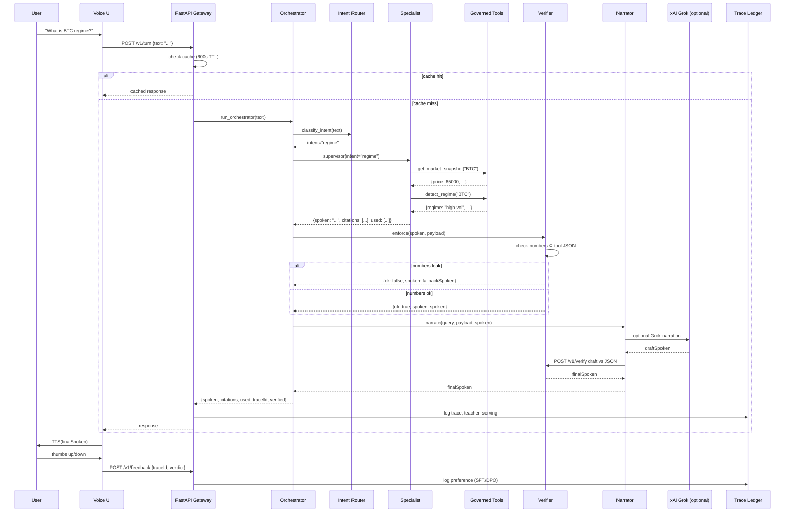
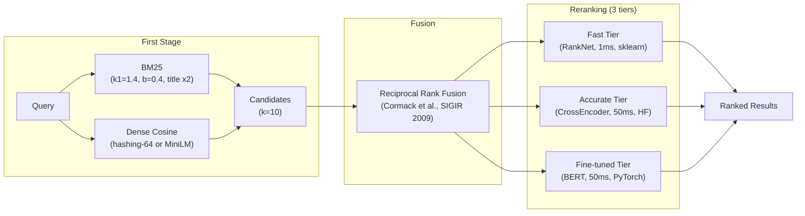
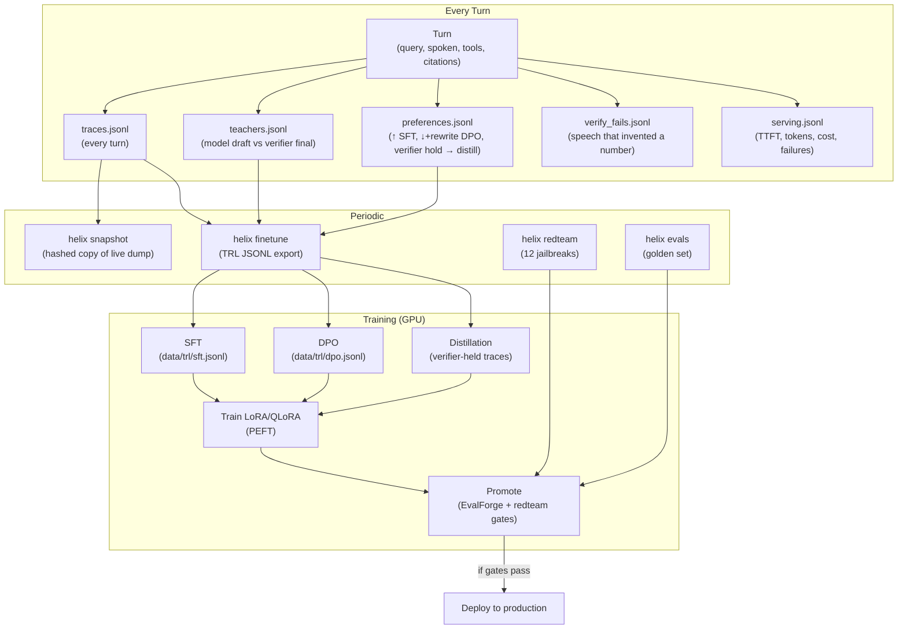
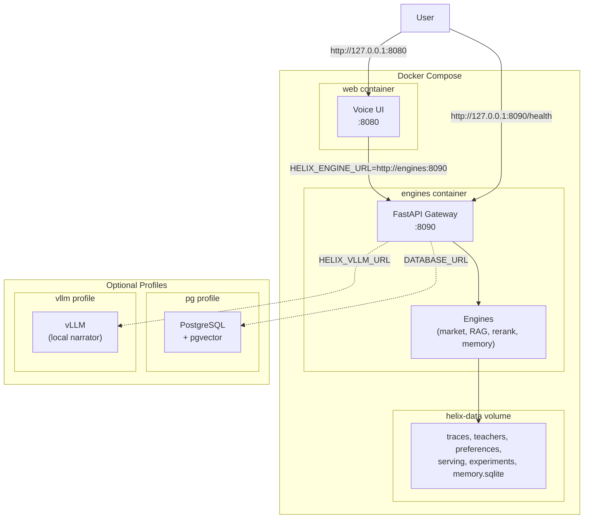
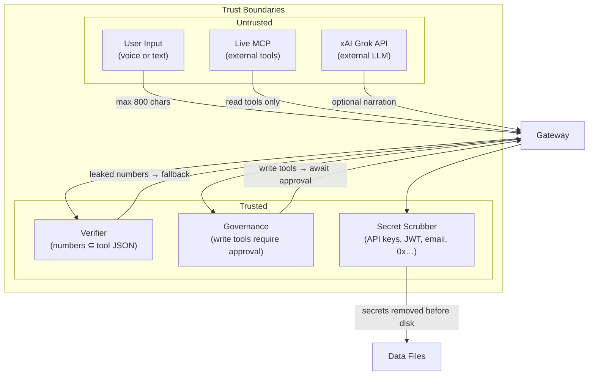

# Helix Architecture

This document describes the architecture of the Helix voice-agent orchestration system. All diagrams use Mermaid syntax and render on GitHub.

---

## System Context (C4 Level 1)

Who uses the system and what external systems it interacts with.

**Key boundaries**:
- **User**: speaks or types. Never sees raw tool JSON.
- **Voice UI**: STT → gateway → TTS. Fallback router if Python is down.
- **FastAPI Gateway**: single entry point. Routes to orchestrator, returns structured JSON.
- **Orchestrator**: intent classification → specialist → tools → verifier.
- **Governed Tools**: auto-run for read, human-approve for write. Never auto-execute orders.
- **Verifier**: checks spoken response against tool JSON. Leaked numbers never reach TTS.
- **Trace Ledger**: every turn writes traces, teachers, preferences. Train later; collect now.

---

## Container Diagram (C4 Level 2)

What's inside the Helix system and how the containers interact.

**Container responsibilities**:
- **Voice UI**: STT/TTS, fallback router, typed client to gateway.
- **FastAPI Gateway**: request routing, caching, orchestration, verification, narration.
- **Engines**: market data, RAG, reranking, memory, intent classification.
- **Data**: gitignored files under `python/data/`. Traces, teachers, preferences, serving, experiments, memory.

---

## Component Diagram (C4 Level 3)

What's inside the FastAPI Gateway and how the components interact.

**Component responsibilities**:
- **Endpoints**: REST, SSE, WebSocket. All route to `run_orchestrator`.
- **TtlCache**: 600s TTL, LRU eviction. Identical queries within TTL return cached response.
- **run_orchestrator**: classify intent → route to specialist → run tools → verify → narrate.
- **classify_intent**: lexical rules (priority) → hashing-trick cosine vs intent prototypes. Score < 0.12 → `general`.
- **supervisor**: maps intent to specialist. Each specialist is a tool-selection policy, not a second LLM.
- **specialists**: quant (market, regime, anomaly, backtest), copilot (risk, portfolio, memory), research (RAG + rerank), eval (golden set), training (checkpoints).
- **enforce**: checks spoken response against tool JSON. Leaked numbers → fallback spoken.
- **narrate**: optional Grok narration. Route: vLLM → xAI → tools. If all fail, use fallback spoken.

---

## Data Flow: Single Turn

**Key invariants**:
- Cache checked before orchestrator. Identical queries within 600s return cached response.
- Intent classified without LLM. Lexical rules + cosine similarity.
- Specialist is a tool-selection policy, not a second LLM.
- Verifier runs twice: once after specialist, once after optional Grok narration.
- Leaked numbers never reach TTS. Fallback spoken is used instead.
- Every turn writes to trace ledger. Train later; collect now.

---

## Retrieval Pipeline

**First stage**: BM25 + dense cosine. BM25 uses Okapi saturation, IDF, explicit length normalization. Dense uses hashing-trick (64-d, CI default) or MiniLM (optional, `[nlp]` extra).

**Fusion**: reciprocal rank fusion (RRF). Fuses on rank, not score. Scores from BM25 and dense cosine are incomparable; ranks are not.

**Reranking**: three tiers, selected by `HELIX_RERANKER_TIER` env var.
- **Fast** (default): RankNet pairwise logistic probe on 9 hand-crafted features. ~1ms inference, interpretable weights, CPU-only. Acceptance gate: ships only if it beats the hand prior on holdout nDCG@5.
- **Accurate**: HF CrossEncoder pre-trained on MS-MARCO. ~50ms inference, black-box, requires `sentence-transformers`.
- **Fine-tuned**: PyTorch BERT fine-tuned on domain qrels. ~50ms inference, domain-adapted for financial jargon and ticker symbols. Requires GPU for training (RTX 2060 6GB sufficient for DistilBERT).

All three tiers share the same first-stage candidate set.

---

## Training Flywheel

**Every turn writes**:
- `traces.jsonl`: query, intent, tools used, citations, latency, tokens, cost.
- `teachers.jsonl`: model draft vs verifier final. If verifier changed the spoken response, the diff is a training signal.
- `preferences.jsonl`: thumbs-up → SFT pair. Thumbs-down + rewrite → DPO pair. Verifier hold → distill pair.
- `verify_fails.jsonl`: speech that invented a number. Negative examples for safety training.
- `serving.jsonl`: TTFT, tokens in/out, cost, failure rate. For monitoring, not training.

**Periodic**:
- `helix snapshot`: hashed copy of the live dump. Version the dataset so you can answer "which reranker won on which dataset version."
- `helix finetune`: export to TRL JSONL for SFT/DPO. Training is a separate GPU job.
- `helix redteam`: 12 jailbreak prompts. Fail closed, not open.
- `helix evals`: golden set with Recall@K, MRR, nDCG, groundedness, citation correctness.

**Training (GPU)**:
- SFT: supervised fine-tuning on thumbs-up traces.
- DPO: direct preference optimization on thumbs-down + rewrite traces.
- Distillation: verifier-held traces are high-quality, no-noise examples.
- Train LoRA/QLoRA: parameter-efficient fine-tuning with PEFT.
- Promote: EvalForge gates (nDCG ≥ 0.72, Recall@5 ≥ 0.80, groundedness ≥ 0.85, p95 < 800ms, cost < $0.02) + redteam pass rate. If gates fail, model doesn't ship.

---

## Deployment (Docker Compose)

**Default compose**:
- `engines`: FastAPI + pandas/NumPy/sklearn + verifier/ledger/memory/redteam/MCP client. Port 8090.
- `web`: Voice UI (React/Next.js). Port 8080. `HELIX_ENGINE_URL=http://engines:8090`.
- `helix-data` volume: traces, DPO pairs, SQLite. Persists across container restarts.

**Optional profiles**:
- `pg`: PostgreSQL + pgvector. Set `DATABASE_URL` and run `docker compose --profile pg up`. Two Helix processes can share memory via ANN search.
- `vllm`: vLLM for local narrator. Requires NVIDIA GPU + weights. Set `HELIX_VLLM_URL` and run `docker compose --profile vllm up`.

**Live MCP from host**: set `HELIX_MCP_URL` in `.env` and `HELIX_ALLOW_SIMULATOR=false`. The engines container uses host DNS (`extra_hosts: host.docker.internal`). Do not publish 8090 past localhost.

---

## Security Model

**Trust boundaries**:
- **User input**: max 800 chars. No SQL injection, no prompt injection (verifier checks numbers, not semantics).
- **Live MCP**: read tools only. Write tools (`propose_rebalance`, `execute`) require human approval. Dead MCP → silence, not a GBM price.
- **xAI Grok**: optional narration. Verifier runs again after Grok returns. Leaked numbers never reach TTS.

**Trusted components**:
- **Verifier**: checks spoken response against tool JSON. If numbers leak, fallback spoken is used.
- **Governance**: write tools set `writeBlocked` and refuse in speech. Secret-exfil prompts refuse to print keys.
- **Secret scrubber**: API keys, JWT, email, long `0x…` addresses are scrubbed **before** disk. Train later; collect now.

---

## Honest Boundaries

**What's wired**:
- FastAPI gateway with REST, SSE, WebSocket.
- Hybrid retrieval (BM25 + dense + RRF) with three-tier reranking.
- Model drift detection (metric, serving, input).
- A/B testing framework (paired permutation test on MRR).
- Performance dashboard (single-pane ops view).
- Training flywheel (traces → TRL JSONL → SFT/DPO).
- Docker Compose for local dev.
- Kubernetes manifests (not battle-tested).
- TorchServe config (wired, not deployed).

**What's proven**:
- CPU-only path (no GPU required for default path).
- SQLite memory (pgvector optional).
- Local tools (live MCP optional).
- Hashing embeddings (MiniLM optional).

**What's not proven**:
- Distributed training (PyTorch DDP). Requires multiple GPUs.
- Kubernetes deployment. Manifests exist, not run in production.
- TorchServe for fine-tuned reranker. Config exists, not deployed.
- Fine-tuning on RTX 2060. Metadata committed, weights gitignored.

---

**Last updated**: 2026-09-18
