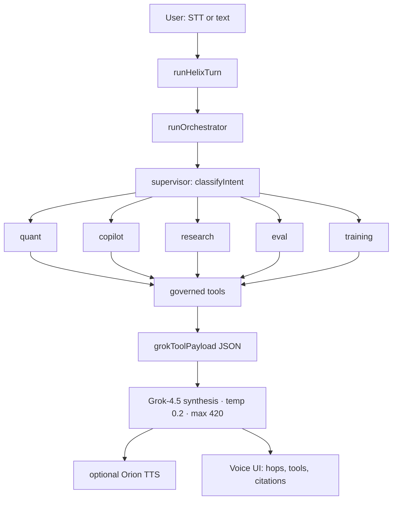
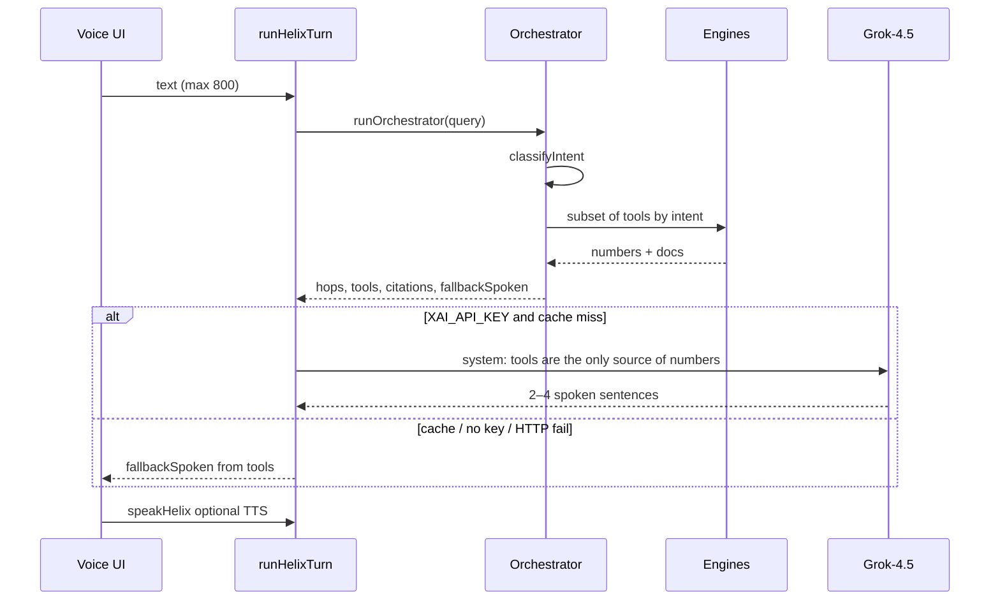

# Helix — Voice agent orchestration

Portfolio implementation of the AI/ML stack on Oleh Kornii’s résumé, as a **voice-first** copilot. No Java. Python-style engines (regimes, RAG, evals, LoRA-style rerank) run in the app; Grok is used only to speak after tools return numbers.

[](https://github.com/OlegUnreal/voice-agent-orchestration/actions/workflows/ci.yml)

> **LLM does not pick tools and does not invent VaR, Sharpe, or prices.** The control loop is TypeScript. Grok sees JSON *after* the engines run.

## Architecture

Helix is a **tool-first supervisor**, not ReAct and not a multi-LLM swarm. Two hops per turn: supervisor routes intent, one specialist calls a governed tool bundle.



A specialist is a **tool-selection policy**, not a second language model. For `portfolio`, copilot pulls snapshot + regime + anomalies + risk + RAG in one bundle.

### Agents

| Agent | Intents | Tools |
|---|---|---|
| **supervisor** | all | `classifyIntent` in [`router.ts`](src/lib/helix/router.ts) |
| **quant** | `regime`, `anomaly`, `backtest` | snapshot, regime, z-score events, SMA backtest |
| **copilot** | `risk`, `portfolio` | VaR / CVaR / scenario P&L |
| **research** | `research` | hybrid RAG + logistic rerank |
| **eval** | `eval` | golden-set metrics |
| **training** | `training` | checkpoint registry |

Intent → agent map lives in [`orchestrator.ts`](src/lib/helix/orchestrator.ts):

```ts
const INTENT_AGENT = {
  regime: "quant",
  anomaly: "quant",
  backtest: "quant",
  risk: "copilot",
  research: "research",
  portfolio: "copilot",
  eval: "eval",
  training: "training",
  general: "supervisor",
};
```

### How the supervisor classifies

Two layers in [`src/lib/helix/router.ts`](src/lib/helix/router.ts), no round-trip to Grok:

1. **Lexical rules** (priority): backtest, VaR/shock, anomaly, regime, eval, LoRA/train, portfolio, research.
2. **Embedding prototypes**: hashing-trick vector of the query vs nine intent prototypes. Cosine `< 0.12` → `general`.

### Tools (MCP-style, not MCP wire protocol)

Registry in [`src/lib/helix/mcp.ts`](src/lib/helix/mcp.ts): JSON schemas + governance. Execution is inline in the orchestrator.

| Tool | Server | Governance |
|---|---|---|
| `get_market_snapshot` | market | auto |
| `detect_regime` | market | auto |
| `detect_anomalies` | market | auto |
| `run_backtest` | market | auto |
| `estimate_risk` | market | auto |
| `retrieve_evidence` | retrieval | auto |
| `get_eval_report` | eval | auto |
| `get_checkpoint_status` | eval | auto |
| `propose_rebalance` | market | **approve** — listed, never auto-run |

Each call is wrapped in `timed()` → `{ name, args, ms, ok, summary }`. That audit trail is what the Gateway view shows.

### One turn



Contract for the language model in [`src/lib/helix/chat.ts`](src/lib/helix/chat.ts):

> TOOL RESULTS are the only source of numbers. Never invent prices, Sharpe, VaR, or citations.

Payload is compact JSON: intent, tool summaries, `numbers`, citations, snapshot / risk / backtest, eval gates. Cache TTL is 10 minutes on the normalized query. If `XAI_API_KEY` is missing, the UI still runs — `fallbackSpoken` is authored from the same tool numbers.

### Grounding

A turn is `grounded` when citation ids exist **or** a quant tool fired (snapshot / backtest / risk). RAG is hybrid: cosine + token overlap + ticker/title hit + recency (14-day half-life) + a chronological mask (`doc.ts > asOf` is dropped). Rerank is a logistic adapter (LoRA analog). Up to four citation ids go to both the UI and Grok.

## What maps to the résumé

| Résumé system | In Helix |
|---|---|
| ChainLens Quant & Market Intelligence | Markets: GBM tape, regime labels, z-score anomalies, SMA crossover backtest, scenario P&L / VaR |
| MLLLM layer (embeddings, rerank, RAG, chronological eval) | RAG lab + hashed 64-d embeddings + recency + date mask |
| SFT / LoRA / QLoRA | TrainingOps: logistic adapters (r8 / r4) trained on golden qrels |
| ChainLens AI Gateway & Financial Copilot | Voice graph + Gateway: routing, cache, structured tools, traces, approval on `propose_rebalance` |
| EvalForge TrainingOps & Model Registry | EvalForge metrics + staging → shadow → canary → production gates |
| MCP, FastAPI/Pydantic-style tools | MCP tool registry with JSON schemas |
| Voice agent orchestration | Orb STT → supervisor → specialist tools → Grok synthesis → TTS |

| Pattern | In this repo | Production next step |
|---|---|---|
| Supervisor + specialists | 2-hop graph | LangGraph state machine, retry, parallel specialists |
| MCP tools | Schemas + governance labels | Real MCP server + JSON-RPC |
| Governed execution | `auto` vs `approve` in the registry | Interrupt / HITL on `propose_rebalance` |
| Structured outputs | JSON payload → Grok | JSON schema / tool-calling on synthesis |
| Model routing + cache | grok-4.5 / cache / local-tools | Dedicated gateway router |
| Traces | Seed traces + live hops | Persistent traces → feedback dataset |

## Local engines (no GPU)

- Deterministic market simulator and risk math
- Hybrid retrieval + logistic reranker you can actually train
- Golden set: Recall@K, MRR, nDCG, intent/tool accuracy, groundedness, p95, cost

## Layout

```
src/lib/helix/           engines (market, rag, evals, training, orchestrator, mcp)
src/lib/helix/router.ts  supervisor intent classifier
src/lib/helix/chat.ts    Grok synthesis + TTS (server)
src/components/helix/    Voice, Markets, RAG, Gateway, Evals, Training
```

## Run

```bash
npm ci
npm run typecheck
npm run build
npm run dev
```

Optional: set `XAI_API_KEY` for live Grok synthesis and TTS. Without it, the quant / RAG / eval engines still run and Helix falls back to tool-authored speech.

Try: *What is BTC’s current regime?* · *Portfolio risk if BTC drops 12 percent.*
