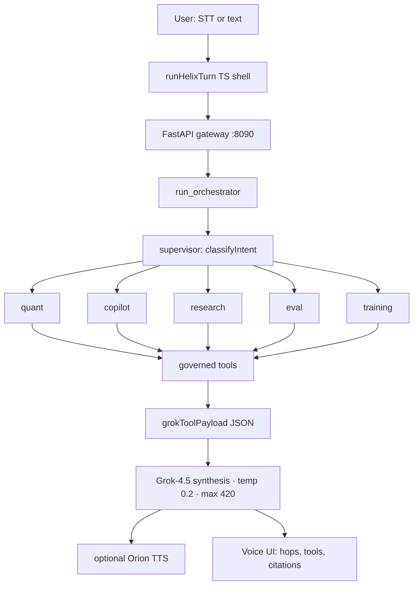
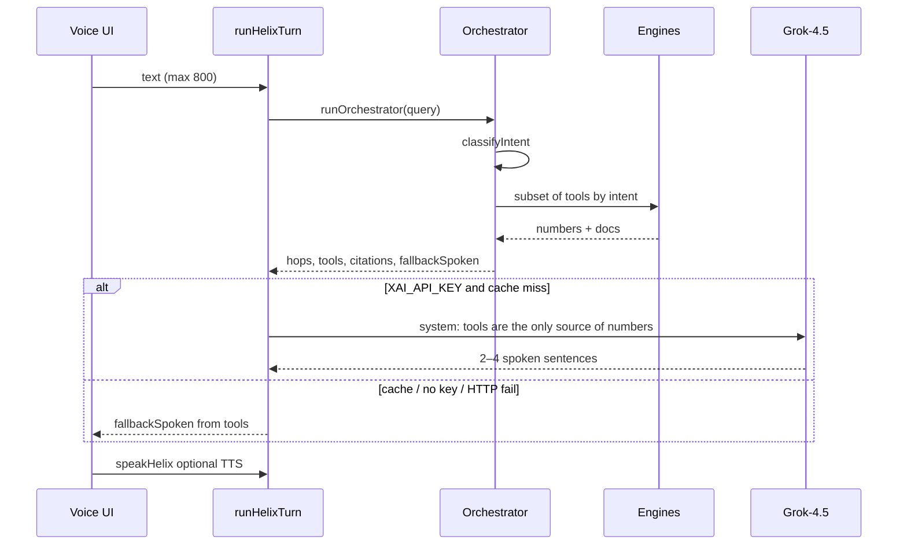

# Helix — Voice agent orchestration

Voice-first financial copilot. **Python is the source of truth** for quant, RAG, EvalForge and TrainingOps (FastAPI, Pydantic, pandas, NumPy, scikit-learn). TypeScript is the voice/UI shell. Grok only speaks after tools return numbers.

[](https://github.com/OlegUnreal/voice-agent-orchestration/actions/workflows/ci.yml)

> **LLM does not pick tools and does not invent VaR, Sharpe, or prices.** The control loop is FastAPI + Pydantic. Grok sees JSON *after* the engines run.

## Python engines (résumé stack)

| Résumé tool | In `python/helix/` |
|---|---|
| FastAPI + Pydantic | [`gateway/app.py`](python/helix/gateway/app.py) — structured routes, TTL cache, JSON-RPC `/mcp` |
| pandas / NumPy | [`market.py`](python/helix/market.py) — GBM tape, regimes, z-score anomalies, SMA backtest, HS/parametric/MC VaR |
| RAG + embeddings + rerank | [`embeddings.py`](python/helix/embeddings.py), [`rag.py`](python/helix/rag.py), [`reranker.py`](python/helix/reranker.py) |
| scikit-learn | LogisticRegression sanity-check next to NumPy SGD LoRA r8 / QLoRA r4 |
| EvalForge | [`evals.py`](python/helix/evals.py) — golden set, Recall@K, MRR, nDCG, groundedness, dataset version hash |
| TrainingOps | [`training.py`](python/helix/training.py) — qrels → adapters → staging/shadow/canary/production |
| MCP tools | [`mcp.py`](python/helix/mcp.py) + `POST /mcp` (`tools/list`, `tools/call`; `propose_rebalance` → 403) |

```bash
cd python
python -m venv .venv && .venv/bin/pip install -e ".[dev]"
.venv/bin/pytest -q
.venv/bin/helix serve
.venv/bin/helix turn "What is BTC's current regime?"
```

Voice, EvalForge and TrainingOps in the UI call this gateway (`HELIX_ENGINE_URL`). If it is down, the TypeScript engines are a fallback so the demo still runs.

## Live OK-Trader (Project Hub MCP)

Helix does **not** call `http://ok-trader:8080/api/v1` — that REST stays on the private Docker network. Live trading context comes from the same Streamable HTTP MCP you already expose on Tailscale.

```bash
export OK_TRADER_MCP_URL='https://hidden-horny-smile-vps.tail59dec0.ts.net/mcp'
export HELIX_ALLOW_SIMULATOR=false   # do not invent prices if Hub is down
.venv/bin/helix mcp                  # initialize + tools/list
.venv/bin/helix turn "BTC mark price and open positions"
```

Session flow matches your Hub: `initialize` → `Mcp-Session-Id` → `tools/list` / `tools/call`. Write tools (order, cancel, kill-switch, execute) are discovered and **never auto-run**. Read tools (price, klines, positions, risk preflight, portfolio context) are picked by intent.

This preview machine is not on your tailnet, so live calls will fail here until Helix runs next to Hub (`http://project-hub-mcp:8080/mcp`) or on a Tailscale node. Copy [`python/ok-trader.env.example`](python/ok-trader.env.example).


## Architecture


Helix is a **tool-first supervisor**, not ReAct and not a multi-LLM swarm. Two hops per turn: supervisor routes intent, one specialist calls a governed tool bundle.



A specialist is a **tool-selection policy**, not a second language model. For `portfolio`, copilot pulls snapshot + regime + anomalies + risk + RAG in one bundle.

### Agents

| Agent | Intents | Tools |
|---|---|---|
| **supervisor** | all | `classify_intent` in [`router.py`](python/helix/router.py) |
| **quant** | `regime`, `anomaly`, `backtest` | snapshot, regime, z-score events, SMA backtest |
| **copilot** | `risk`, `portfolio` | VaR / CVaR / scenario P&L |
| **research** | `research` | hybrid RAG + logistic rerank |
| **eval** | `eval` | golden-set metrics |
| **training** | `training` | checkpoint registry |

Intent → agent map lives in [`orchestrator.py`](python/helix/orchestrator.py):

```ts
const INTENT_AGENT = {
  regime: "quant",
  anomaly: "quant",
  backtest: "quant",
  risk: "copilot",
  research: "research",
  portfolio: "copilot",
  eval: "eval",
  training: "training",
  general: "supervisor",
};
```

### How the supervisor classifies

Two layers in [`src/lib/helix/router.ts`](src/lib/helix/router.ts), no round-trip to Grok:

1. **Lexical rules** (priority): backtest, VaR/shock, anomaly, regime, eval, LoRA/train, portfolio, research.
2. **Embedding prototypes**: hashing-trick vector of the query vs nine intent prototypes. Cosine `< 0.12` → `general`.

### Tools (MCP-style, not MCP wire protocol)

Registry in [`src/lib/helix/mcp.ts`](src/lib/helix/mcp.ts): JSON schemas + governance. Execution is inline in the orchestrator.

| Tool | Server | Governance |
|---|---|---|
| `get_market_snapshot` | market | auto |
| `detect_regime` | market | auto |
| `detect_anomalies` | market | auto |
| `run_backtest` | market | auto |
| `estimate_risk` | market | auto |
| `retrieve_evidence` | retrieval | auto |
| `get_eval_report` | eval | auto |
| `get_checkpoint_status` | eval | auto |
| `propose_rebalance` | market | **approve** — listed, never auto-run |

Each call is wrapped in `timed()` → `{ name, args, ms, ok, summary }`. That audit trail is what the Gateway view shows.

### One turn



Contract for the language model in [`src/lib/helix/chat.ts`](src/lib/helix/chat.ts):

> TOOL RESULTS are the only source of numbers. Never invent prices, Sharpe, VaR, or citations.

Payload is compact JSON: intent, tool summaries, `numbers`, citations, snapshot / risk / backtest, eval gates. Cache TTL is 10 minutes on the normalized query. If `XAI_API_KEY` is missing, the UI still runs — `fallbackSpoken` is authored from the same tool numbers.

### Grounding

A turn is `grounded` when citation ids exist **or** a quant tool fired (snapshot / backtest / risk). RAG is hybrid: cosine + token overlap + ticker/title hit + recency (14-day half-life) + a chronological mask (`doc.ts > asOf` is dropped). Rerank is a logistic adapter (LoRA analog). Up to four citation ids go to both the UI and Grok.

## What maps to the résumé

| Résumé system | In Helix |
|---|---|
| ChainLens Quant & Market Intelligence | Markets: GBM tape, regime labels, z-score anomalies, SMA crossover backtest, scenario P&L / VaR |
| MLLLM layer (embeddings, rerank, RAG, chronological eval) | RAG lab + hashed 64-d embeddings + recency + date mask |
| SFT / LoRA / QLoRA | TrainingOps: logistic adapters (r8 / r4) trained on golden qrels |
| ChainLens AI Gateway & Financial Copilot | Voice graph + Gateway: routing, cache, structured tools, traces, approval on `propose_rebalance` |
| EvalForge TrainingOps & Model Registry | EvalForge metrics + staging → shadow → canary → production gates |
| MCP, FastAPI/Pydantic-style tools | MCP tool registry with JSON schemas |
| Voice agent orchestration | Orb STT → supervisor → specialist tools → Grok synthesis → TTS |

| Pattern | In this repo | Production next step |
|---|---|---|
| Supervisor + specialists | 2-hop graph | LangGraph state machine, retry, parallel specialists |
| MCP tools | Schemas + governance labels | Real MCP server + JSON-RPC |
| Governed execution | `auto` vs `approve` in the registry | Interrupt / HITL on `propose_rebalance` |
| Structured outputs | JSON payload → Grok | JSON schema / tool-calling on synthesis |
| Model routing + cache | grok-4.5 / cache / local-tools | Dedicated gateway router |
| Traces | Seed traces + live hops | Persistent traces → feedback dataset |

## Local engines (no GPU)

- Deterministic market simulator and risk math
- Hybrid retrieval + logistic reranker you can actually train
- Golden set: Recall@K, MRR, nDCG, intent/tool accuracy, groundedness, p95, cost

## Layout

```
python/helix/            FastAPI gateway + engines (source of truth)
src/lib/helix/           TypeScript shell + fallback
src/lib/helix/engine.ts  HTTP client to the Python gateway
src/components/helix/    Voice, Markets, RAG, Gateway, Evals, Training
```


## Run

```bash
npm ci
npm run typecheck
npm run build
npm run dev
```

Optional: set `XAI_API_KEY` for live Grok synthesis and TTS. Without it, the quant / RAG / eval engines still run and Helix falls back to tool-authored speech.

Try: *What is BTC’s current regime?* · *Portfolio risk if BTC drops 12 percent.*
